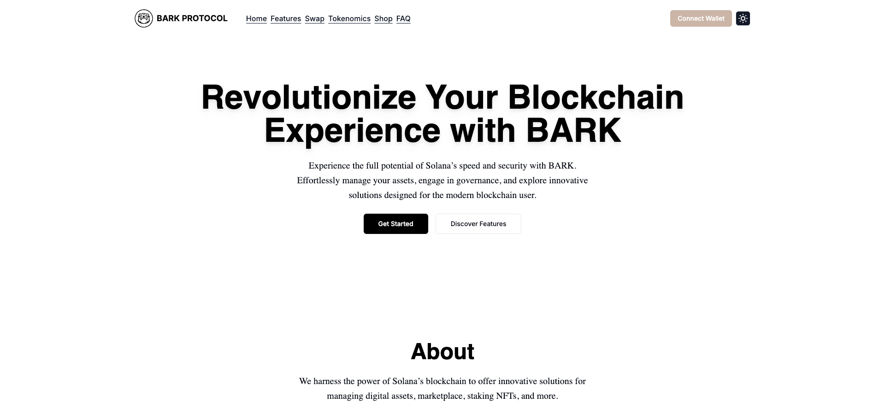

# Bark Protocol

Welcome to the Bark Protocol! This landing page is designed to enhance digital asset management on the Solana blockchain, focusing on innovative solutions for NFTs, products, payments, and governance.



## Website and Blogger Generator

This repository serves as the website and blogger generator for Bark Protocol, bootstrapped using the [BARK - Blink Actions Tool](https://github.com/barkprotocol/blink-actions-tool).

## Features

- **Customizable Website Generation**: Quickly generate and deploy websites for your projects using our tools.
- **Blogger Integration**: Seamlessly integrate blog functionalities into your website.
- **Enhanced Digital Experience**: Leverage our platform for managing NFTs, payments, and more on Solana.

## Installation

To get started, clone the repository and install the dependencies:

```bash
git clone https://github.com/barkprotocol/bark-protocol.git
cd bark-protocol
pnpm install
```

## Usage

To start the development server, run:

```bash
pnpm run dev
```

For production builds, use:

```bash
pnpm run build
pnpm start
```

## Contributing

We welcome contributions to improve the Bark Protocol. Please refer to our [contributing guidelines](docs/CONTRIBUTING.md) for more details.

## References

- **Icons**: [Lucide Icons](https://lucide.dev/icons/)

## License

This project is licensed under the [MIT License](LICENSE).
